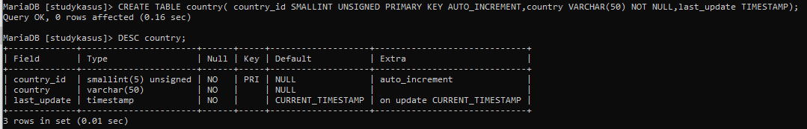
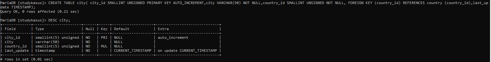
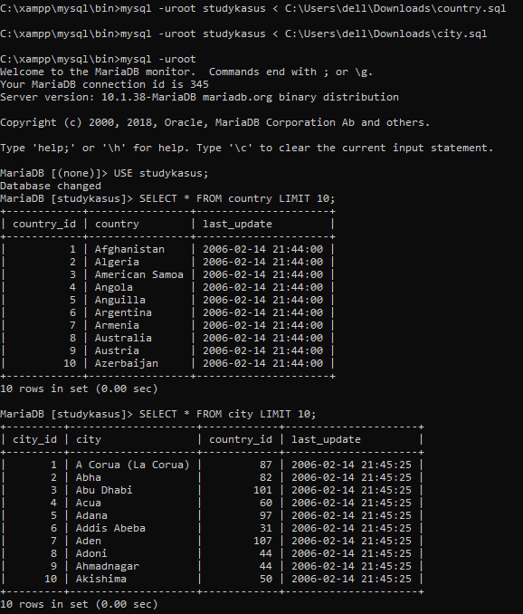
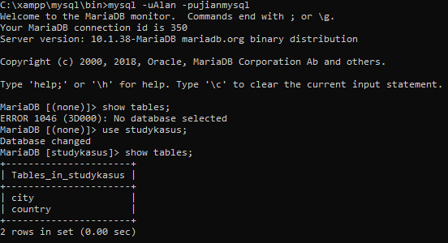
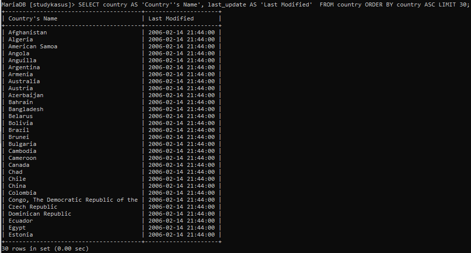
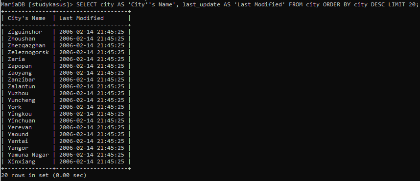
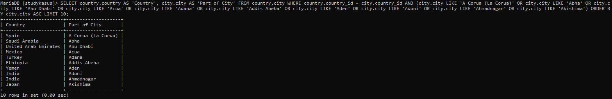
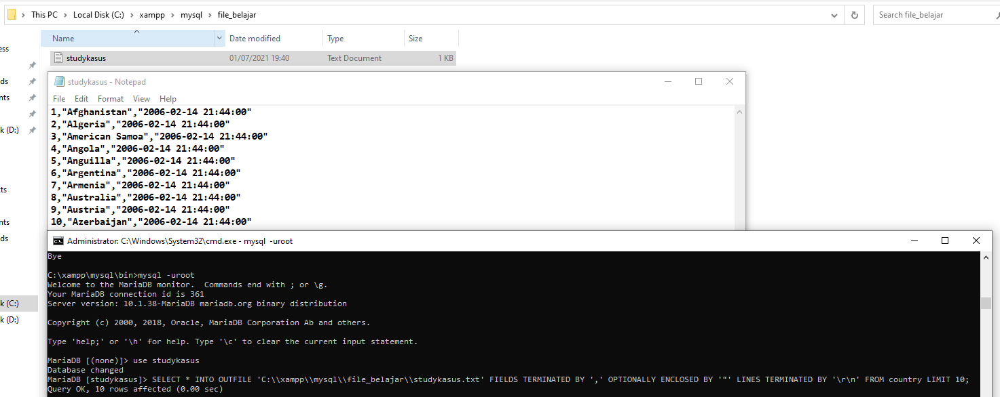

# Study_Kasus_MySQL

### 1. Buat database studykasus
```mysql
CREATE DATABASE studykasus;
```


### 2. Buat table country dengan struktur sebagai berikut:


```mysql
CREATE TABLE country( 
	country_id SMALLINT UNSIGNED PRIMARY KEY AUTO_INCREMENT,
	country VARCHAR(50) NOT NULL,
	last_update TIMESTAMP
);
```



### 3. Buat table city dengan struktur sebagai berikut:


```mysql
CREATE TABLE city( 
	city_id SMALLINT UNSIGNED PRIMARY KEY AUTO_INCREMENT,
	city VARCHAR(50) NOT NULL,
	country_id SMALLINT UNSIGNED NOT NULL, 
	FOREIGN KEY (country_id) REFERENCES country (country_id),
	last_update TIMESTAMP
);
```



### 4. Download country.sql dan city.sql kemudian import data dummy tersebut ke masing-masing table!
###   Link country.sql : https://drive.google.com/file/d/1duiOMXM3pZCnutM0qjTjabL7SrtlWQi0/view
###   Link city.sql : https://drive.google.com/file/d/1E_m5KyHEJgAvVLaZt9HPX9-nxsVUo69A/view



### 5. Buat user Alan dengan Password ‘ujianmysql’ kemudian berikan hak akses untuk table country dan city dari database studykasus!
```mysql
CREATE user 'Alan'@'localhost' identified by 'ujianmysql';
```

```mysql
GRANT ALL ON studykasus.country TO Alan@localhost;
```

```mysql
GRANT ALL ON studykasus.city TO Alan@localhost;
```



### 6. Tampilkan 30 data untuk kolom country As `Country’s Name`, last_update As `Last Modified` dari tabel country diurutkan berdasarkan kolom country dari A ke Z!
```mysql
SELECT country AS 'Country''s Name', last_update AS 'Last Modified' 
FROM country 
ORDER BY country ASC LIMIT 30;
```



### 7. Tampilkan 20 data untuk kolom city As `City’s Name`, last_update As `Last Modified` dari tabel city diurutkan berdasarkan kolom country dari Z ke A!
```mysql
SELECT city AS 'City''s Name', last_update AS 'Last Modified' 
FROM city 
ORDER BY city DESC LIMIT 20;
```



### 8. Tampilkan 10 data perpaduan dari tabel country dan city seperti gambar berikut!
```mysql
SELECT country.country AS 'Country', city.city AS 'Part of City' 
FROM country,city 
WHERE country.country_id = city.country_id AND (city.city LIKE 'A Corua (La Corua)' 
OR city.city LIKE 'Abha' OR city.city LIKE 'Abu Dhabi' OR city.city LIKE 'Acua' OR city.city LIKE 'Adana' OR city.city LIKE 'Addis Abeba' OR city.city LIKE 'Aden' OR city.city LIKE 'Adoni' OR city.city LIKE 'Ahmadnagar' OR city.city LIKE 'Akishima') 
ORDER BY city.city ASC 
LIMIT 10;
```



### 9. Export 10 data tersebut dengan perintah “**Export Data SELECT … INTO OUTFILE**” dengan pemisah antar kolom yaitu koma (,) dan dalam format **.txt** dengan nama file yaitu **studykasus.txt**
```mysql
SELECT * INTO OUTFILE 'C:\\xampp\\mysql\\file_belajar\\studykasus.txt' 
FIELDS TERMINATED BY ',' OPTIONALLY ENCLOSED BY '"' 
LINES TERMINATED BY '\r\n' 
FROM country 
LIMIT 10;
```


